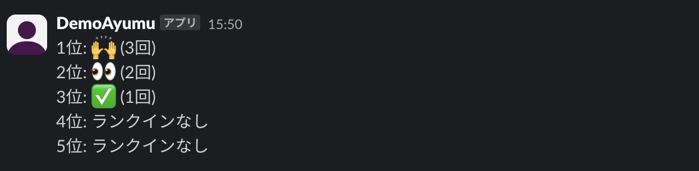

## リアクションのランキング機能

### 動作イメージ
1. 集計期間に応じてbotが招待されているチャンネルのリアクション使用数を算出する
2. その結果をchannel idに紐づいたチャンネルに対して投稿する

### BOTの権限
Botの利用には下記の権限の付与が必要なのでそれぞれ設定してください。

- channels:history
- channels:read
- chat:write

また、投稿先の情報としてchannel idが必要です。
SLACK_REACTION_RANKING_CHANNEL_IDという名前で環境変数として登録してください。